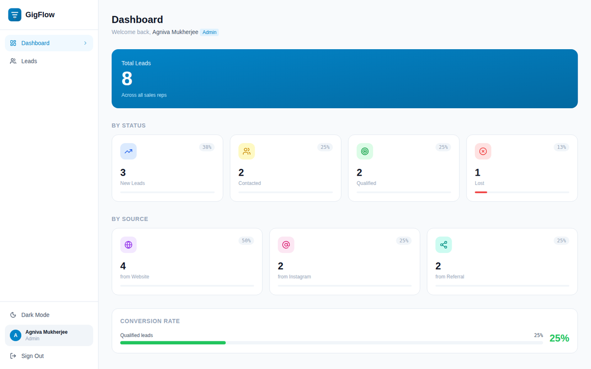
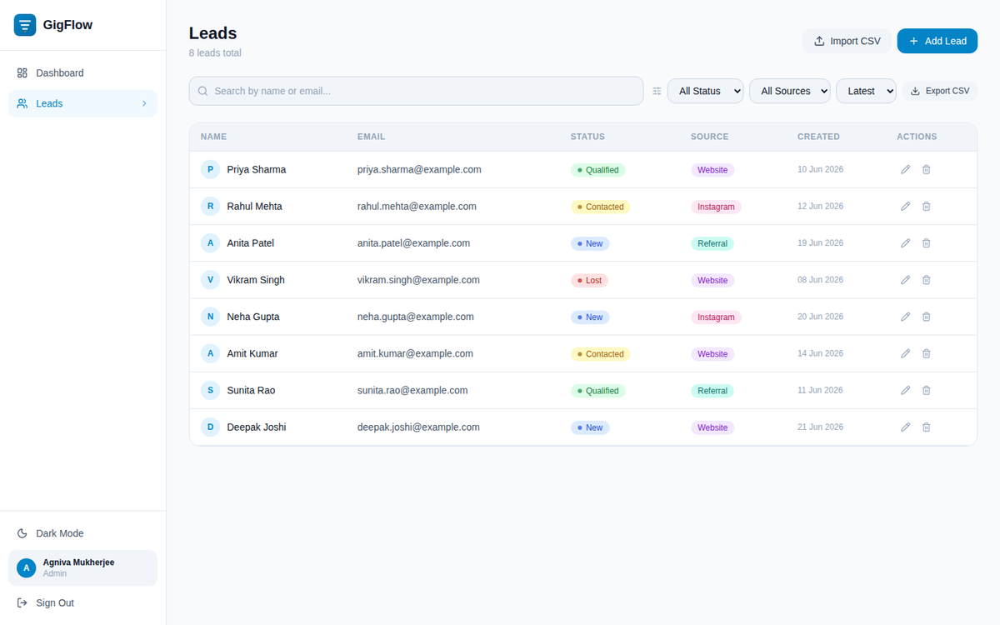
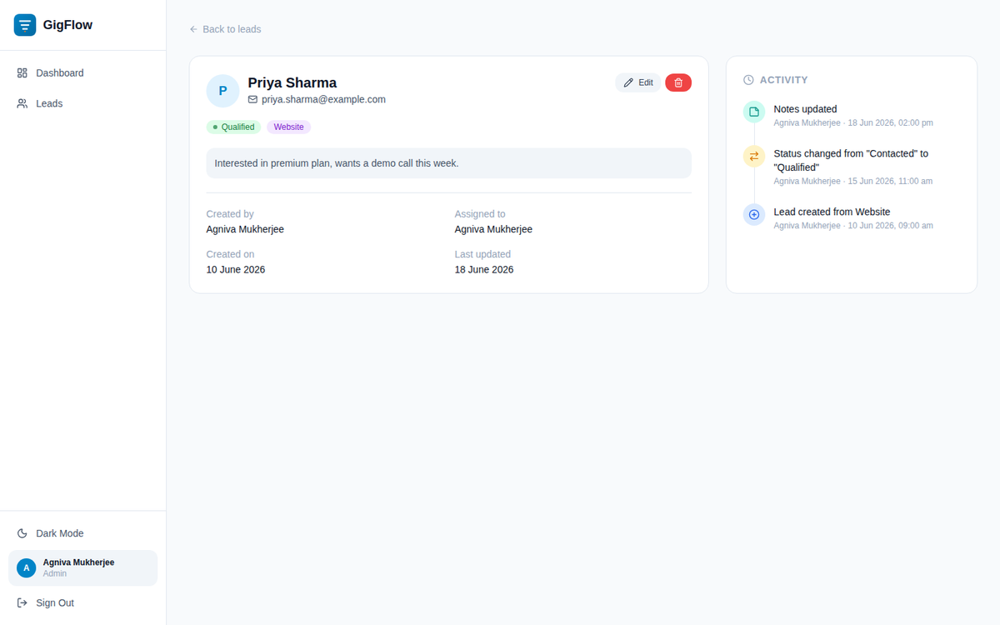
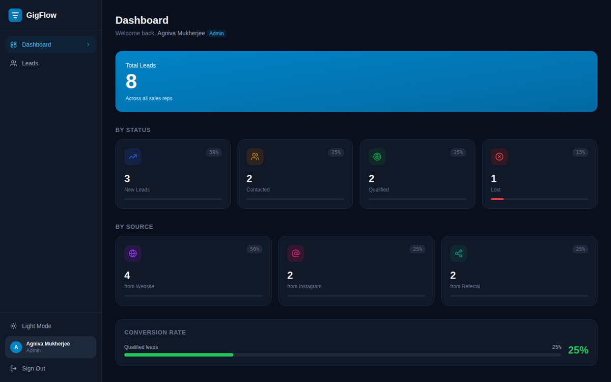
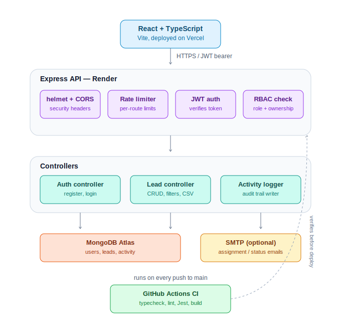
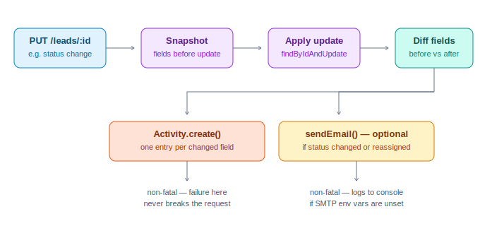

<div align="center">


**A full-stack leads management platform with JWT auth, role-based access control,
an auditable activity trail, and CSV import/export — built and deployed end to end.**

[](https://github.com/agniva1803/GigFlow/actions/workflows/ci.yml)
[](https://reactjs.org)
[](https://typescriptlang.org)
[](https://nodejs.org)
[](https://mongodb.com)
[](https://jestjs.io)
[](#license)

[**Live demo**](https://gig-flow-mkbrj3ijl-agniva-mukherjees-projects-8ea5e944.vercel.app) ·
[API health check](https://gigflow-kn78.onrender.com/health) ·
[API docs (Swagger)](https://gigflow-kn78.onrender.com/api-docs) ·
[Postman collection](docs/GigFlow.postman_collection.json)

</div>

---

## Contents

- [Why this project exists](#why-this-project-exists)
- [Screenshots](#screenshots)
- [Architecture](#architecture)
- [Feature breakdown](#feature-breakdown)
- [Tech stack](#tech-stack)
- [Project structure](#project-structure)
- [Local setup](#local-setup)
- [Running tests](#running-tests)
- [Docker](#docker)
- [API reference](#api-reference)
- [Database schema](#database-schema)
- [Security notes](#security-notes)
- [Deployment](#deployment)
- [License](#license)

---

## Why this project exists

GigFlow started as a take-home assignment ("build a leads dashboard with auth and
filtering") and was extended past the original brief to demonstrate the things a
production codebase actually needs: an audit trail for every change, tests that run
in CI on every push, rate limiting and security headers, and API documentation that
isn't a paragraph in a README.

The brief asked for CRUD. This repo also has: a permission model with real test
coverage proving sales reps cannot see each other's leads, an activity log that
diffs lead state instead of just logging "lead updated," a bulk CSV importer that
reports per-row failures instead of rejecting the whole batch, and a CI pipeline
that fails the build if any of that regresses.

## Screenshots

<table>
<tr>
<td width="50%">

**Dashboard** — live stats by status and source



</td>
<td width="50%">

**Leads** — search, filter, sort, paginate, import, export



</td>
</tr>
<tr>
<td width="50%">

**Lead detail** — full audit trail per lead



</td>
<td width="50%">

**Dark mode** — persisted theme, every surface re-themed



</td>
</tr>
</table>

## Architecture



Every request from the React client carries a JWT bearer token. On the API side it
passes through `helmet` (security headers), a rate limiter (tighter on
`/auth/*` and `/leads/bulk-import`), JWT verification, and a role/ownership check —
sales reps are scoped to leads they created, admins see everything. The controller
layer applies the change, the activity logger writes a diffed audit entry, and an
optional email fires if the lead was reassigned or its status changed. GitHub
Actions runs the full test suite, typecheck, and build on every push before any of
this reaches Render or Vercel.

The activity log specifically works like this:



The controller snapshots the lead's fields before applying an update, diffs before
vs. after, and writes one activity entry **per changed field** — so a single
request that both reassigns a lead and changes its status produces two distinct,
readable timeline entries instead of one vague "lead updated" line. No-op updates
(setting a field to the value it already has) write zero entries — verified in
`leads.test.ts`.

## Feature breakdown

### Authentication & authorization
- JWT auth, bcrypt password hashing (12 rounds), `select: false` on the password
  field so it is never accidentally serialized.
- Two roles — **admin** (sees and manages every lead) and **sales** (scoped to
  leads they created). Enforced server-side on every read and write, not just hidden
  in the UI.
- Public registration always creates a `sales` account. A client-supplied `role`
  field is never honored on that endpoint — accepting it would let anyone register
  as admin and get cross-tenant read access. Admin accounts are provisioned via the
  seed script. This is covered by a dedicated test
  (`always creates a "sales" account ... even if the request body claims role=admin`).
- Login returns an identical error for "wrong password" and "email not found," to
  avoid leaking which emails are registered.

### Activity audit trail
- Every create, update, and delete writes to an `Activity` collection with the
  actor, the action, and — for updates — the specific field, the before value, and
  the after value.
- Surfaced as a timeline on the lead detail page (`GET /leads/:id/activity`).
- Audit writes are intentionally non-fatal: if the activity log fails to write, the
  parent request still succeeds. An audit trail that can break your CRUD endpoint
  is worse than no audit trail.

### Email notifications
- Fires when a lead is reassigned or its status changes.
- Backed by a small abstraction (`utils/email.ts`): if SMTP env vars are set, it
  sends via `nodemailer`; if not, it logs the email to the console. This means the
  feature is fully exercised in local/demo environments with zero configuration,
  and becomes "real" the moment SMTP credentials are added — no code change needed.

### Bulk CSV import
- Client-side parsing with `papaparse` (handles quoted fields and embedded commas
  correctly — a hand-rolled `split(',')` parser would not).
- Each row is validated independently server-side. One malformed row does not
  reject the batch — the response reports `createdCount`, `errorCount`, and a
  per-row error list (`row 4: Invalid or missing email`), the same pattern Stripe
  and HubSpot's CSV importers use.
- Capped at 500 rows per request and rate-limited to 10 requests/hour per IP.

### Filtering, search, pagination
- Server-side `status`/`source` filters, case-insensitive name/email search, sort
  by latest/oldest, and cursor-free page/limit pagination with `hasNext`/`hasPrev`
  metadata — all computed in MongoDB, not in application memory.

### CSV export
- Streams a CSV of the leads matching the *current* filters (not just the current
  page), so exporting after filtering by `status=Qualified` exports only qualified
  leads.

## Tech stack

| Layer | Technology | Why |
|---|---|---|
| Frontend | React 18, TypeScript, Vite | Fast dev loop, strict types catch API contract drift |
| Frontend state | Zustand (auth/theme), TanStack Query (server state) | Query handles caching/invalidation; Zustand avoids context boilerplate for two small global stores |
| Styling | Tailwind CSS | Utility classes plus CSS custom properties for theming, no runtime CSS-in-JS cost |
| CSV parsing | papaparse | Correctly handles quoted/escaped CSV — a regex split silently corrupts real-world exports |
| Backend | Node.js, Express, TypeScript | |
| Validation | express-validator | Declarative request validation, consistent error shape |
| Database | MongoDB + Mongoose | Schema-level validation, indexes on the fields the dashboard actually filters/sorts by |
| Auth | jsonwebtoken, bcryptjs | |
| Security | helmet, express-rate-limit | Security headers + abuse mitigation on auth and bulk-import routes |
| Email | nodemailer | Swappable transport; logs instead of sending when unconfigured |
| API docs | swagger-jsdoc, swagger-ui-express | Live, interactive docs served at `/api-docs` |
| Testing | Jest, Supertest, mongodb-memory-server | Tests run against a real in-memory MongoDB, not a mocked query builder |
| CI/CD | GitHub Actions | Typecheck, lint, test, and build on every push to `main` |
| Deployment | Vercel (frontend), Render (backend), MongoDB Atlas | |

## Project structure

```
GigFlow/
├── .github/workflows/ci.yml        # typecheck + lint + Jest + build, both apps
├── backend/
│   ├── src/
│   │   ├── __tests__/              # auth.test.ts, leads.test.ts, setup.ts
│   │   ├── config/                 # database connection, swagger spec
│   │   ├── controllers/            # auth, lead (CRUD, stats, bulk import, activity)
│   │   ├── middleware/             # auth (JWT/RBAC), rate limiter, validation, errors
│   │   ├── models/                 # User, Lead, Activity (Mongoose schemas)
│   │   ├── routes/                 # Express routers per resource
│   │   ├── types/                  # shared TypeScript interfaces
│   │   ├── utils/                  # JWT, response shape, activity logger, email, seed
│   │   └── validators/             # express-validator chains
│   ├── jest.config.js
│   └── Dockerfile
├── frontend/
│   ├── src/
│   │   ├── api/                    # axios instance + typed API functions
│   │   ├── components/
│   │   │   ├── auth/                # ProtectedRoute
│   │   │   ├── layout/               # Sidebar, Layout
│   │   │   ├── leads/                # table, form, filters, activity timeline, bulk import
│   │   │   └── ui/                    # Button, Input, Select, Badge, Modal, Skeleton
│   │   ├── pages/                  # Login, Register, Dashboard, Leads, LeadDetail
│   │   └── store/                  # Zustand: auth, theme
│   ├── public/assets/               # logo-mark.svg, logo-lockup.svg
│   └── Dockerfile
├── docs/
│   ├── GigFlow.postman_collection.json
│   └── images/                     # architecture diagrams + UI screenshots
├── docker-compose.yml
└── render.yaml
```

## Local setup

### Prerequisites
Node.js 18+, and either a local MongoDB instance or a free
[MongoDB Atlas](https://www.mongodb.com/cloud/atlas) cluster.

```bash
git clone https://github.com/agniva1803/GigFlow
cd GigFlow
```

### Backend

```bash
cd backend
cp .env.example .env
# Fill in MONGODB_URI and JWT_SECRET at minimum
npm install
npm run dev          # http://localhost:5000
```

### Frontend

```bash
cd frontend
cp .env.example .env
npm install
npm run dev           # http://localhost:5173
```

### Seed demo data

```bash
cd backend
npm run seed
```

Creates `admin@gigflow.com` / `admin123` (admin), `sales@gigflow.com` / `sales123`
(sales), 10 sample leads, and a matching activity log entry for each.

## Running tests

```bash
cd backend
npm test                # Jest + Supertest against an in-memory MongoDB
npm run test:coverage   # same, with a coverage report
```

Tests spin up a real `mongodb-memory-server` instance per run rather than mocking
Mongoose's query builder — `.find().sort().populate()` chains are easy to mock
incorrectly in a way that passes against the mock but not against real MongoDB
semantics. Coverage includes:

- **Auth**: registration, password hashing (verifies it's never stored in
  plaintext), duplicate-email rejection, password complexity, login,
  user-enumeration resistance, and the privilege-escalation regression test for
  the `role` field.
- **RBAC**: a sales rep cannot list, update, or delete another rep's leads; an
  admin can see leads from every rep; unauthenticated requests are rejected.
- **CRUD + filtering**: default status on create, source validation, status
  filtering, case-insensitive search, and pagination metadata correctness.
- **Activity log**: a create writes one entry, a status change writes a
  `from`/`to` entry, and a no-op update writes zero new entries.
- **Bulk import**: valid rows are created, invalid rows are reported with their
  row number and reason, and an empty payload is rejected.
- **Stats**: per-status and per-source aggregates are correctly scoped to the
  requesting user's role.

CI (`.github/workflows/ci.yml`) runs this full suite, a TypeScript typecheck, ESLint,
and a production build for both apps on every push and pull request to `main`.

## Docker

```bash
cp .env.example .env
# set JWT_SECRET in .env
docker-compose up --build
```

Brings up MongoDB, the backend (`:5000`), and the frontend behind Nginx (`:80`) with
a health-checked startup order.

## API reference

Full interactive documentation is served at `/api-docs` (Swagger UI) and the raw
OpenAPI spec at `/api-docs.json`. A ready-to-import
[Postman collection](docs/GigFlow.postman_collection.json) is also included — its
login request auto-saves the returned JWT into a collection variable so every
other request just works.

### Auth

| Method | Endpoint | Auth | Notes |
|---|---|---|---|
| POST | `/api/auth/register` | — | Always creates a `sales` account |
| POST | `/api/auth/login` | — | Rate-limited: 20 attempts / 15 min |
| GET | `/api/auth/me` | ✅ | Current user |

### Leads

| Method | Endpoint | Auth | Role | Notes |
|---|---|---|---|---|
| GET | `/api/leads` | ✅ | any | `page`, `limit`, `status`, `source`, `search`, `sort` |
| POST | `/api/leads` | ✅ | any | |
| GET | `/api/leads/:id` | ✅ | owner/admin | |
| PUT | `/api/leads/:id` | ✅ | owner/admin | Diffs changed fields, writes activity + email |
| DELETE | `/api/leads/:id` | ✅ | owner/admin | |
| GET | `/api/leads/:id/activity` | ✅ | owner/admin | Audit trail, newest first |
| POST | `/api/leads/bulk-import` | ✅ | any | Max 500 rows; rate-limited: 10/hour |
| GET | `/api/leads/stats` | ✅ | any | Scoped to caller's role |
| GET | `/api/leads/export/csv` | ✅ | any | Respects active filters |

## Database schema

```
User
├─ name, email (unique), password (bcrypt, select:false)
└─ role: 'admin' | 'sales'

Lead
├─ name, email, status: New|Contacted|Qualified|Lost, source: Website|Instagram|Referral
├─ notes (optional, max 500 chars)
├─ createdBy → User   (ownership boundary for RBAC)
├─ assignedTo → User  (optional; drives email notifications)
└─ indexes: status, source, createdAt, text(name, email)

Activity
├─ lead → Lead, actor → User
├─ action: created|status_changed|assigned|updated|deleted|note_added
├─ field, fromValue, toValue   (present on diff-based entries)
├─ message   (human-readable, e.g. 'Status changed from "New" to "Contacted"')
└─ index: (lead, createdAt) — timeline queries are O(log n)
```

## Security notes

A few things worth calling out explicitly, since they're the kind of detail that's
easy to get wrong silently:

- **No client-controlled roles.** Registration cannot set `role: admin` — see
  [Authentication & authorization](#authentication--authorization) above. This was
  caught and fixed during a security review of this exact codebase.
- **The database-reset seed route is off by default.** `/api/seed/run` only exists
  if both `ENABLE_SEED_ROUTE=true` and `SEED_SECRET` are set in the environment —
  otherwise it 404s as if it doesn't exist. It is not wired to a hardcoded secret
  anywhere in source control.
- **Ownership is enforced server-side, on every request**, not inferred from what
  the UI happens to show. A sales rep hitting `PUT /api/leads/:id` for a lead they
  don't own gets a 403 regardless of what the client sends.
- **Login errors don't leak account existence** — invalid password and unknown
  email return the identical message and status code.
- **Rate limiting is tiered**: 20/15min on auth endpoints (the highest-value
  brute-force target), 10/hour on bulk import (the most expensive single request,
  up to 500 writes), 300/15min on everything else under `/api`.

## Deployment

| Service | Platform | Notes |
|---|---|---|
| Frontend | [Vercel](https://vercel.com) | `frontend/` as root, `VITE_API_URL` pointed at the Render backend |
| Backend | [Render](https://render.com) | `backend/` as root, build `npm install && npm run build`, start `node dist/server.js` |
| Database | [MongoDB Atlas](https://mongodb.com/cloud/atlas) | Free M0 tier, Mumbai region |

`render.yaml` and `docker-compose.yml` are both included if you'd rather deploy via
Render's infra-as-code or a single-VM Docker setup.

## License

MIT — see [LICENSE](LICENSE).

---

<div align="center">

Built by <a href="https://github.com/agniva1803">Agniva Mukherjee</a> ·
<a href="https://www.linkedin.com/in/agniva-mukherjee-b2647b21a">LinkedIn</a>

</div>
